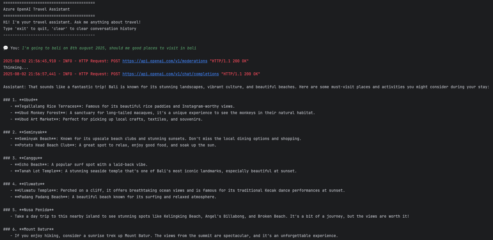
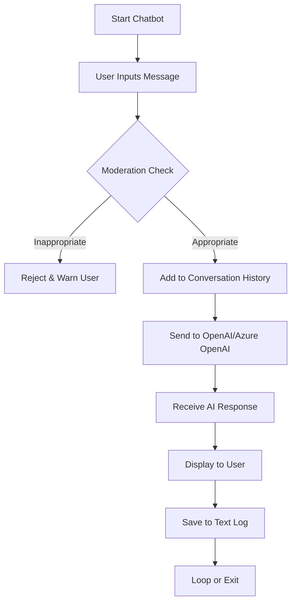

# Azure OpenAI Travel Chatbot

A command-line chatbot powered by Azure OpenAI (or OpenAI) that acts as a friendly travel assistant.  
It provides advice about travel destinations, planning, and tips, with content moderation and conversation logging.

## Features

- Interactive, terminal-based chat
- Azure OpenAI (or OpenAI) API support
- Content moderation for safe, friendly conversations
- Saves all conversations to a local text file (`conversation_log.txt`)
- Maintains recent chat history for context
- Logging for debugging and traceability

## 🏗️ Project Structure


├── chatbot.py # Main chatbot code\
├── conversation_log.txt # Chat transcript (auto-generated)\
├── chatbot.log # Application logs\
├── .env # Environment variables (API keys, endpoint, etc.)\
├── ss1.png # Sample output screenshot\
└── README.md

## Setup

1. **Clone the repository**

    ```bash
    git clone <repo-url>
    cd <project-folder>
    ```

2. **Create a virtual environment and activate it**
    ```bash
    python3 -m venv .venv
    source .venv/bin/activate
    ```

3. **Install dependencies**
    ```bash
    pip install openai python-dotenv
    ```
    For Azure OpenAI, also install:
    ```bash
   pip install azure-openai
    ```
   
4. **Add your credentials to `.env`**
    ```bash
    OPENAI_API_KEY=your-openai-or-azure-key
    OPENAI_API_VERSION=2024-02-15-preview
    OPENAI_API_ENDPOINT=https://<your-resource>.openai.azure.com/
    OPENAI_DEPLOYED_MODEL=gpt-35-turbo
    ```
   
## Usage
Run the chatbot:
```bash
python chatbot.py
```
Sample interaction:
```
========================================
Azure OpenAI Travel Assistant
========================================

Hi! I'm your travel assistant. Ask me anything about travel!
Type 'exit' to quit, 'clear' to clear conversation history
----------------------------------------

💬 You: Suggest a weekend trip near Bangalore.
Thinking...

Assistant: Sure! Here are a few great weekend getaways from Bangalore...
```

## Sample Output


## Flowchart


## License

[MIT License](LICENSE)